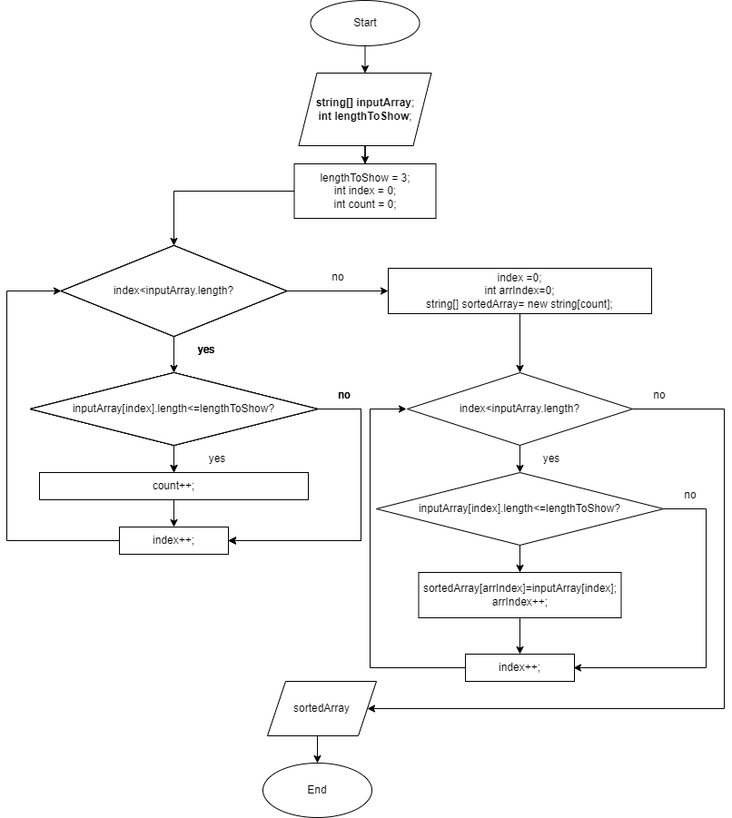

# Итоговая проверочная работа
1) Создать репозиторий на GitHub:
    репозиторий создан: * https://github.com/andrewsavinkov/assignment_1Term.git
2) Нарисовать блок-схему алгоритма:

3) Описание решения:
 * вводим строковый массив вручную
 * задаем необходимую длину переменной для отсечки по массиву
 * создаем вспомогательный список формата List < string > для хранения найденных строк
 * пробегаемся по исходному массиву, применяем условие:
    
    если длина элемента под индексом index равна заданной длине (в нашем случае 3), 

    то элемент попадает в созданный ранее список

* поскольку по условию задачи на выходе должен быть массив строк, а не список, создаем массив строк sortedArray с длиной, равной длине ранее созданного списка (при помощи атрибута .Count)
* пробегаемся по массиву sortedArray и переносим в него по порядку соответствующие элементы из ранее созданного списка. 
